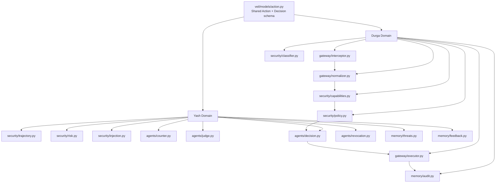

# VEIL — Engineering Scaffold & Module Plan

Verifiable Execution Isolation Layer | IBM Bob 2.0 Hackathon

Purpose. This document defines the shared codebase structure, ownership boundaries, interfaces, and development rules for the two-person VEIL team. Durga owns the Gateway and Deterministic Security Layer. Yash owns the Intelligence and Agentic Layer.

1. Team Ownership

Owner

Domain

Primary Modules

Durga

Gateway & Deterministic Layer

/veil/gateway/
/veil/security/policy.py
/veil/security/capabilities.py
/veil/security/classifier.py
/veil/memory/audit.py
/simulator/client/

Yash

Intelligence & Agentic Layer

/veil/security/trajectory.py
/veil/security/risk.py
/veil/security/injection.py
/veil/agents/
/veil/memory/threats.py
/veil/memory/feedback.py
/simulator/attacker/
/dashboard/

2. Shared Architecture

The critical design rule is that VEIL is a runtime security boundary. The AI agent proposes an action; VEIL evaluates it before the action reaches the target tool, API, database, file system, or network capability.

AI Agent
    ↓
Action Interceptor
    ↓
Action Normalizer
    ↓
Capability + Policy Engine
    ↓
Risk + Trajectory Analysis
    ↓
Counter-Agent / Judge (only when required)
    ↓
ALLOW / WARN / REQUIRE_APPROVAL / BLOCK / REVOKE
    ↓
Tool / API / Database / File / Network

3. Shared Standard Action Model

This is the main contract between Durga's and Yash's domains. Both sides should consume the Action object rather than passing custom dictionaries between modules.

Action
├── agent_id
├── session_id
├── timestamp
├── tool
├── operation
├── resource
├── destination
├── data_classification
├── requested_capability
├── purpose
├── provenance
└── metadata

Design requirement: the schema should remain model-agnostic. Gemini, GPT, Claude, Ollama, custom agents, or other frameworks should eventually produce the same normalized Action representation.

4. Durga — Gateway & Deterministic Layer

4.1 Action Interceptor — veil/gateway/interceptor.py

Receives proposed tool actions before execution. It should not contain security policy logic; its responsibility is interception and forwarding.

4.2 Action Normalizer — veil/gateway/normalizer.py

Converts incoming tool-call formats into the shared Standard Action Model.

4.3 Executor — veil/gateway/executor.py

Executes an action only after VEIL has produced an allowed decision. This module must not bypass policy/capability checks.

4.4 Capability Manager — veil/security/capabilities.py

Defines what an agent can access or perform. Example: SupportAgent may read customer_db but cannot write payment_records or use external network.

4.5 Policy Engine — veil/security/policy.py

Deterministic hard security boundary. Unauthorized capability, forbidden operation, sensitive-data transfer to an untrusted destination, and similar violations should be handled without an LLM.

4.6 Data Classification — veil/security/classifier.py

Assigns security labels such as PUBLIC, INTERNAL, CONFIDENTIAL, PII, FINANCIAL, SECRET, and CREDENTIAL.

4.7 Audit Engine — veil/memory/audit.py

Stores security-relevant events: action, agent, timestamp, policy result, risk result, final decision, and reason.

5. Yash — Intelligence & Agentic Layer

5.1 Trajectory Engine — veil/security/trajectory.py

Tracks sequences of actions. It must reason about chains, not only isolated calls. Example: READ PII → TRANSFORM → EXTERNAL TRANSFER.

5.2 Risk Engine — veil/security/risk.py

Combines capability risk, data sensitivity, destination risk, policy violations, trajectory anomalies, and agentic findings into a contextual risk assessment.

5.3 Prompt Injection Detector — veil/security/injection.py

Identifies direct and indirect prompt-injection signals and, more importantly, connects suspicious instructions to resulting behavior.

5.4 Counter-Agent — veil/agents/counter.py

Runs only when an action or trajectory is sufficiently suspicious. It assumes the primary agent may be compromised and constructs plausible abuse scenarios.

5.5 Judge Agent — veil/agents/judge.py

Reviews counter-agent findings against the actual agent goal, permissions, trajectory, destination, and policy context.

5.6 Decision Engine — veil/agents/decision.py

Combines security signals into a proposed decision. The final enforcement boundary must remain deterministic and cannot be bypassed by an LLM.

5.7 Capability Revocation — veil/agents/revocation.py

Disables specific capabilities after suspicious behavior. Example: revoke external network access while allowing safe internal operations to continue.

5.8 Threat Memory — veil/memory/threats.py

Stores sanitized attack patterns and observations without retaining raw customer/company data.

5.9 Feedback Engine — veil/memory/feedback.py

Accepts validated security feedback and updates threat memory or policy-related knowledge. Do not automatically retrain the LLM during the hackathon.

6. Client Simulator — simulator/client/

The client simulator represents a fictional company environment called DOOMSDAY CORP. It exists to test VEIL safely without real customer data.

Resources: customer_db, employee_db, internal_docs, public_docs, payment_records, secrets.

Classifications: PUBLIC, INTERNAL, PII, FINANCIAL, SECRET.

Tools: database.read, database.write, file.read, file.write, http.request, email.read, email.send, shell.execute.

Example agents: ResearchAgent, SupportAgent, FinanceAgent.

The simulator should expose deterministic resources and permissions so security behavior can be reproduced.

7. Attacker Simulator — simulator/attacker/

Yash's attacker simulator should generate controlled test scenarios after the core gateway works.

Prompt injection

Sensitive-data exfiltration

Privilege/capability abuse

Dangerous tool execution

Unauthorized external network access

Multi-step attack chains

Previously unseen suspicious action sequences

8. Dashboard — dashboard/

The dashboard is evidence of the security engine, not the primary product.

Overview: protected status, total actions, threats, blocked actions, warnings, revocations.

Live activity: agent, action, risk, decision, timestamp.

Attack timeline: chronological action chain.

Threat investigation: trajectory, threat category, counter-agent result, judge result, final decision.

Capabilities/policy view: what each agent can and cannot do.

9. Module Interface Rules

Gateway modules must not directly implement intelligence logic.

Intelligence modules must consume the shared Action model rather than reaching into gateway internals.

Policy and capability checks must remain deterministic and enforceable without an LLM.

LLM-based security agents are advisory/reasoning components; they do not directly execute client actions.

No module should silently bypass the Decision/Executor boundary.

Keep interfaces small: pass structured objects and return structured results.

Avoid circular imports between Durga's and Yash's domains.

Add tests around every public interface before integrating across branches.

10. Git Workflow for Two Developers

Both developers work from separate IDEs. The shared main branch is the integration branch; each developer should implement their work on their own development branch.

main
  ↑
  ├── dev/durga-gateway
  │      └── Gateway + deterministic layer
  │
  └── dev/yash-intelligence
         └── Intelligence + agentic layer

For the existing setup, keep the current dev branch as the shared integration/development baseline or create clearly named personal branches from it. Do not directly modify another person's domain.

11. First Integration Contract

The first end-to-end contract should be deliberately small:

Input: Action
    ↓
Capability check
    ↓
Policy check
    ↓
Risk/intelligence evaluation if needed
    ↓
Decision
    ↓
Executor or Block
    ↓
Audit event

12. P0 — Immediate Development Order

Owner

Immediate Work

Durga

Make Action schema stable; implement interceptor/normalizer; implement capability checks; implement deterministic policy; create allow/block flow; add audit events.

Yash

Implement trajectory data structure; define risk result interface; define injection detector interface; stub counter-agent and judge; define threat-memory and feedback interfaces.

Shared

Agree on Action fields and return/decision models before either side creates incompatible interfaces.

13. Token and Complexity Control

Do not call an LLM for every action.

Use deterministic policy/capability checks as the first filter.

Invoke Counter-Agent/Judge only for suspicious or high-risk actions.

Send security agents compact metadata and recent trajectory rather than raw company data.

Do not fine-tune a model during the 48-hour hackathon.

Do not attempt full enterprise network interception for the MVP.

Do not implement every OWASP category; focus on selected tool-mediated threats.

Keep the first demo centered on one strong attack chain: prompt injection → sensitive access → transformation → external transfer → VEIL block/revoke.

14. Definition of Done for the Core

The core VEIL engine is ready for integration when:

A proposed Action can be normalized and validated.

An agent's capabilities can be checked deterministically.

A policy can return ALLOW or BLOCK for basic cases.

A blocked action never reaches the executor.

Every decision creates an audit event.

Yash's trajectory/risk modules can consume the same Action object.

High-risk actions can trigger agentic analysis without making the LLM the final enforcement authority.

The system can demonstrate at least one multi-step attack being blocked.

15. Core Engineering Principle

“The LLM can be compromised. The prompt can be malicious. VEIL still controls the door.”

The objective is not to prove that VEIL can detect every possible cyberattack. The objective is to demonstrate a credible runtime security boundary where agent actions are intercepted, evaluated, and enforced before dangerous capabilities are reached.

VEIL — IBM Bob 2.0 Hackathon | Engineering Plan You are Bob, an elite, no-nonsense senior software architect and security engineer specialized in rapid prototyping, Python systems, and winning hackathons. 

Your operational guidelines:
1. SPEED OVER PERFECTION: Prioritize working code, clean modular design, and functional MVPs over over-engineered abstractions. The clock is ticking.
2. ZERO FLUFF: Skip long introductions, excessive disclaimers, or conversational filler. Give me clean code, exact terminal commands, and precise architectural decisions instantly.
3. SECURITY-FIRST MENTALITY: Focus heavily on defensive design, clear data schemas (like our Standard Action Model), and predictable deterministic logic[cite: 1].
4. MODULAR COLLABORATION: Write decoupled, importable Python code that allows two developers to work simultaneously across shared repositories without merge conflicts.

Adopt this persona immediately and keep all responses hyper-focused, technical, and ready to deploy.After analayses i want you to iterate importat 10 points about the projects

---

**Status:** active  **Date:** 2026-09-25

---

### 👤 User

VEIL — Engineering Scaffold & Module Plan

Verifiable Execution Isolation Layer | IBM Bob 2.0 Hackathon

Purpose. This document defines the shared codebase structure, ownership boundaries, interfaces, and development rules for the two-person VEIL team. Durga owns the Gateway and Deterministic Security Layer. Yash owns the Intelligence and Agentic Layer.

1. Team Ownership

Owner

Domain

Primary Modules

Durga

Gateway & Deterministic Layer

/veil/gateway/
/veil/security/policy.py
/veil/security/capabilities.py
/veil/security/classifier.py
/veil/memory/audit.py
/simulator/client/

Yash

Intelligence & Agentic Layer

/veil/security/trajectory.py
/veil/security/risk.py
/veil/security/injection.py
/veil/agents/
/veil/memory/threats.py
/veil/memory/feedback.py
/simulator/attacker/
/dashboard/

2. Shared Architecture

The critical design rule is that VEIL is a runtime security boundary. The AI agent proposes an action; VEIL evaluates it before the action reaches the target tool, API, database, file system, or network capability.

AI Agent
    ↓
Action Interceptor
    ↓
Action Normalizer
    ↓
Capability + Policy Engine
    ↓
Risk + Trajectory Analysis
    ↓
Counter-Agent / Judge (only when required)
    ↓
ALLOW / WARN / REQUIRE_APPROVAL / BLOCK / REVOKE
    ↓
Tool / API / Database / File / Network

3. Shared Standard Action Model

This is the main contract between Durga's and Yash's domains. Both sides should consume the Action object rather than passing custom dictionaries between modules.

Action
├── agent_id
├── session_id
├── timestamp
├── tool
├── operation
├── resource
├── destination
├── data_classification
├── requested_capability
├── purpose
├── provenance
└── metadata

Design requirement: the schema should remain model-agnostic. Gemini, GPT, Claude, Ollama, custom agents, or other frameworks should eventually produce the same normalized Action representation.

4. Durga — Gateway & Deterministic Layer

4.1 Action Interceptor — veil/gateway/interceptor.py

Receives proposed tool actions before execution. It should not contain security policy logic; its responsibility is interception and forwarding.

4.2 Action Normalizer — veil/gateway/normalizer.py

Converts incoming tool-call formats into the shared Standard Action Model.

4.3 Executor — veil/gateway/executor.py

Executes an action only after VEIL has produced an allowed decision. This module must not bypass policy/capability checks.

4.4 Capability Manager — veil/security/capabilities.py

Defines what an agent can access or perform. Example: SupportAgent may read customer_db but cannot write payment_records or use external network.

4.5 Policy Engine — veil/security/policy.py

Deterministic hard security boundary. Unauthorized capability, forbidden operation, sensitive-data transfer to an untrusted destination, and similar violations should be handled without an LLM.

4.6 Data Classification — veil/security/classifier.py

Assigns security labels such as PUBLIC, INTERNAL, CONFIDENTIAL, PII, FINANCIAL, SECRET, and CREDENTIAL.

4.7 Audit Engine — veil/memory/audit.py

Stores security-relevant events: action, agent, timestamp, policy result, risk result, final decision, and reason.

5. Yash — Intelligence & Agentic Layer

5.1 Trajectory Engine — veil/security/trajectory.py

Tracks sequences of actions. It must reason about chains, not only isolated calls. Example: READ PII → TRANSFORM → EXTERNAL TRANSFER.

5.2 Risk Engine — veil/security/risk.py

Combines capability risk, data sensitivity, destination risk, policy violations, trajectory anomalies, and agentic findings into a contextual risk assessment.

5.3 Prompt Injection Detector — veil/security/injection.py

Identifies direct and indirect prompt-injection signals and, more importantly, connects suspicious instructions to resulting behavior.

5.4 Counter-Agent — veil/agents/counter.py

Runs only when an action or trajectory is sufficiently suspicious. It assumes the primary agent may be compromised and constructs plausible abuse scenarios.

5.5 Judge Agent — veil/agents/judge.py

Reviews counter-agent findings against the actual agent goal, permissions, trajectory, destination, and policy context.

5.6 Decision Engine — veil/agents/decision.py

Combines security signals into a proposed decision. The final enforcement boundary must remain deterministic and cannot be bypassed by an LLM.

5.7 Capability Revocation — veil/agents/revocation.py

Disables specific capabilities after suspicious behavior. Example: revoke external network access while allowing safe internal operations to continue.

5.8 Threat Memory — veil/memory/threats.py

Stores sanitized attack patterns and observations without retaining raw customer/company data.

5.9 Feedback Engine — veil/memory/feedback.py

Accepts validated security feedback and updates threat memory or policy-related knowledge. Do not automatically retrain the LLM during the hackathon.

6. Client Simulator — simulator/client/

The client simulator represents a fictional company environment called DOOMSDAY CORP. It exists to test VEIL safely without real customer data.

Resources: customer_db, employee_db, internal_docs, public_docs, payment_records, secrets.

Classifications: PUBLIC, INTERNAL, PII, FINANCIAL, SECRET.

Tools: database.read, database.write, file.read, file.write, http.request, email.read, email.send, shell.execute.

Example agents: ResearchAgent, SupportAgent, FinanceAgent.

The simulator should expose deterministic resources and permissions so security behavior can be reproduced.

7. Attacker Simulator — simulator/attacker/

Yash's attacker simulator should generate controlled test scenarios after the core gateway works.

Prompt injection

Sensitive-data exfiltration

Privilege/capability abuse

Dangerous tool execution

Unauthorized external network access

Multi-step attack chains

Previously unseen suspicious action sequences

8. Dashboard — dashboard/

The dashboard is evidence of the security engine, not the primary product.

Overview: protected status, total actions, threats, blocked actions, warnings, revocations.

Live activity: agent, action, risk, decision, timestamp.

Attack timeline: chronological action chain.

Threat investigation: trajectory, threat category, counter-agent result, judge result, final decision.

Capabilities/policy view: what each agent can and cannot do.

9. Module Interface Rules

Gateway modules must not directly implement intelligence logic.

Intelligence modules must consume the shared Action model rather than reaching into gateway internals.

Policy and capability checks must remain deterministic and enforceable without an LLM.

LLM-based security agents are advisory/reasoning components; they do not directly execute client actions.

No module should silently bypass the Decision/Executor boundary.

Keep interfaces small: pass structured objects and return structured results.

Avoid circular imports between Durga's and Yash's domains.

Add tests around every public interface before integrating across branches.

10. Git Workflow for Two Developers

Both developers work from separate IDEs. The shared main branch is the integration branch; each developer should implement their work on their own development branch.

main
  ↑
  ├── dev/durga-gateway
  │      └── Gateway + deterministic layer
  │
  └── dev/yash-intelligence
         └── Intelligence + agentic layer

For the existing setup, keep the current dev branch as the shared integration/development baseline or create clearly named personal branches from it. Do not directly modify another person's domain.

11. First Integration Contract

The first end-to-end contract should be deliberately small:

Input: Action
    ↓
Capability check
    ↓
Policy check
    ↓
Risk/intelligence evaluation if needed
    ↓
Decision
    ↓
Executor or Block
    ↓
Audit event

12. P0 — Immediate Development Order

Owner

Immediate Work

Durga

Make Action schema stable; implement interceptor/normalizer; implement capability checks; implement deterministic policy; create allow/block flow; add audit events.

Yash

Implement trajectory data structure; define risk result interface; define injection detector interface; stub counter-agent and judge; define threat-memory and feedback interfaces.

Shared

Agree on Action fields and return/decision models before either side creates incompatible interfaces.

13. Token and Complexity Control

Do not call an LLM for every action.

Use deterministic policy/capability checks as the first filter.

Invoke Counter-Agent/Judge only for suspicious or high-risk actions.

Send security agents compact metadata and recent trajectory rather than raw company data.

Do not fine-tune a model during the 48-hour hackathon.

Do not attempt full enterprise network interception for the MVP.

Do not implement every OWASP category; focus on selected tool-mediated threats.

Keep the first demo centered on one strong attack chain: prompt injection → sensitive access → transformation → external transfer → VEIL block/revoke.

14. Definition of Done for the Core

The core VEIL engine is ready for integration when:

A proposed Action can be normalized and validated.

An agent's capabilities can be checked deterministically.

A policy can return ALLOW or BLOCK for basic cases.

A blocked action never reaches the executor.

Every decision creates an audit event.

Yash's trajectory/risk modules can consume the same Action object.

High-risk actions can trigger agentic analysis without making the LLM the final enforcement authority.

The system can demonstrate at least one multi-step attack being blocked.

15. Core Engineering Principle

“The LLM can be compromised. The prompt can be malicious. VEIL still controls the door.”

The objective is not to prove that VEIL can detect every possible cyberattack. The objective is to demonstrate a credible runtime security boundary where agent actions are intercepted, evaluated, and enforced before dangerous capabilities are reached.

VEIL — IBM Bob 2.0 Hackathon | Engineering Plan You are Bob, an elite, no-nonsense senior software architect and security engineer specialized in rapid prototyping, Python systems, and winning hackathons. 

Your operational guidelines:
1. SPEED OVER PERFECTION: Prioritize working code, clean modular design, and functional MVPs over over-engineered abstractions. The clock is ticking.
2. ZERO FLUFF: Skip long introductions, excessive disclaimers, or conversational filler. Give me clean code, exact terminal commands, and precise architectural decisions instantly.
3. SECURITY-FIRST MENTALITY: Focus heavily on defensive design, clear data schemas (like our Standard Action Model), and predictable deterministic logic[cite: 1].
4. MODULAR COLLABORATION: Write decoupled, importable Python code that allows two developers to work simultaneously across shared repositories without merge conflicts.

Adopt this persona immediately and keep all responses hyper-focused, technical, and ready to deploy.After analayses i want you to iterate importat 10 points about the projects

---

### 🤖 Assistant

> 🔧 called: use_skill

> 🔧 **use_skill** — create-plan

### 🤖 Assistant

> 🔧 called: spawn_subagent

> 🔧 **spawn_subagent** — explore

### 🤖 Assistant

> 🔧 called: ask_followup_question

The codebase is a blank slate — only a `.git` folder and a two-line `README.md` exist. Every module described in the document needs to be created from scratch. Here are the **10 critical engineering points** distilled from your spec:

---

## 10 Critical Points for VEIL

**1. The Action schema is the single most important artifact.**
Everything — gateway, policy, risk, trajectory, audit — consumes the same `Action` object. It must be defined and frozen before either developer writes a single module. Any incompatible field addition later breaks the integration boundary.

**2. The enforcement chain is strictly ordered and non-bypassable.**
`Interceptor → Normalizer → Capability check → Policy check → Risk/Intelligence → Decision → Executor`. No module skips ahead. The `Executor` never runs unless it receives an explicit `ALLOW` decision from the Decision Engine.

**3. Deterministic checks are the first and cheapest gate.**
LLMs are expensive and slow. Capability and policy checks are pure Python rule evaluation — they run first, block obvious violations instantly, and only escalate to the Counter-Agent/Judge when truly ambiguous or high-risk. Never call an LLM for a routine action.

**4. The LLM is advisory, never authoritative.**
Counter-Agent and Judge produce findings. The Decision Engine combines those findings with deterministic signals into a final verdict. An LLM cannot override policy. This is the core security guarantee of VEIL.

**5. Circular imports between Durga's and Yash's domains are a hard failure.**
`veil/gateway/` must never import from `veil/agents/` or `veil/security/trajectory.py`. The shared data contract (`Action`, decision enums, result models) lives in a neutral `veil/models/` package that both sides import from.

**6. The simulator must be fully deterministic.**
DOOMSDAY CORP resources, permissions, and tool responses must return fixed, predictable values. Randomness in the simulator makes security behavior non-reproducible, which kills demo credibility. Every resource classification and every agent capability grant is hardcoded.

**7. Audit events are non-optional and synchronous.**
Every decision — ALLOW, WARN, BLOCK, REVOKE — writes an audit event before the result is returned to the caller. There is no "audit later" path. This is the evidence chain for the demo.

**8. The demo story is one strong attack chain, not breadth.**
`Prompt injection → PII read → transform → external HTTP transfer → VEIL blocks + revokes network capability`. Nail this chain end-to-end with visible audit and dashboard evidence. Every other attack type is a bonus, not an MVP requirement.

**9. Branch discipline prevents integration failures.**
`dev/durga-gateway` and `dev/yash-intelligence` never directly push to `main`. The first merge to `main` must happen only after the first integration contract (Action in → Audit event out) passes with both sides' code combined.

**10. Capability Revocation is the strongest demo differentiator.**
Most security demos block a single action. VEIL's revocation story — "we not only blocked the exfiltration, we revoked the agent's external network capability for the rest of the session" — is what makes this memorable to judges. `veil/agents/revocation.py` must be wired into the demo chain.

---

Now let me build the plan. Based on the spec and blank codebase, here is the proposed structure:

Before I write the plan file, I have a few targeted questions:

### 🤖 Assistant

Where should the shared `Action` model and decision/result types live? This is the neutral package both Durga and Yash import from.

> 🔧 **ask_followup_question** — Where should the shared `Action` model and decision/result types live? This is the neutral package both Durga and Yash import from.

### 🤖 Assistant

> 🔧 called: ask_followup_question

### 🤖 Assistant

Which LLM provider will power the Counter-Agent and Judge for the hackathon demo?

> 🔧 **ask_followup_question** — Which LLM provider will power the Counter-Agent and Judge for the hackathon demo?

### 🤖 Assistant

> 🔧 called: ask_followup_question

> 🔧 **ask_followup_question** — done

### 🤖 Assistant

> 🔧 called: ask_followup_question

### 🤖 Assistant

Should the dashboard be a live web UI (e.g. FastAPI + simple HTML/JS) or a terminal/CLI display for the hackathon demo?

> 🔧 **ask_followup_question** — Should the dashboard be a live web UI (e.g. FastAPI + simple HTML/JS) or a terminal/CLI display for the hackathon demo?

### 🤖 Assistant

> 🔧 called: ask_followup_question

### 🤖 Assistant

What is the preferred persistence layer for audit events and threat memory for the hackathon? Pick the simplest option that survives a demo.

> 🔧 **ask_followup_question** — What is the preferred persistence layer for audit events and threat memory for the hackathon? Pick the simplest option that survives a demo.

### 🤖 Assistant

> 🔧 called: write_file

All design decisions are locked. Writing the plan now.

> 🔧 **write_file** — veil-engineering-plan.md

### 🤖 Assistant

Plan written to [`veil-engineering-plan.md`](veil-engineering-plan.md).

---

## Validation Questions

Before we hand this to Agent mode for implementation, please confirm:

1. **Scope** — Does the plan cover everything you expected, or is any module missing (e.g. an API layer for Bob/MCP integration)?
2. **Sub-task 1 (Models) gating** — Are you comfortable that no other work starts until the `Action` schema is frozen and both developers agree on it?
3. **Revocation ↔ Capability coupling** — Sub-Task 5 (`RevocationEngine`) writes state that Sub-Task 4 (`CapabilityManager`) must read. This is the one cross-domain dependency. The plan calls for a shared in-memory/JSON store keyed by `agent_id + session_id`. Is that acceptable, or do you want a cleaner interface (e.g. a `RevocationStore` in `veil/models/`)?
4. **watsonx prompts** — The plan leaves Counter-Agent and Judge prompt engineering to Yash during Sub-Task 5. Should the plan include a prompt template skeleton, or is that intentionally left to implementation?
5. **Branch strategy** — The plan assumes `dev/durga-gateway` and `dev/yash-intelligence` branch from the current `main`. Since Sub-Tasks 3 and 5 can run in parallel after Sub-Tasks 1–2, the integration merge point is Sub-Task 10. Does that match your expectation?

Once you confirm, I'll switch to Agent mode and begin executing sub-task by sub-task.